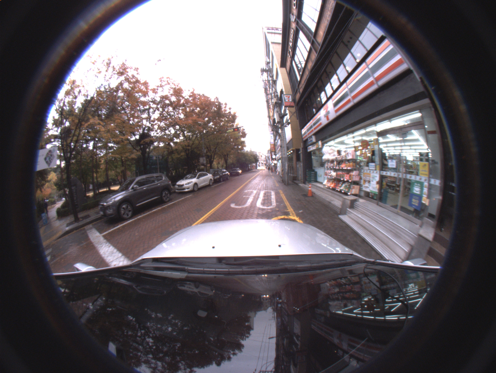

# Fisheye-Dongseongro
2D Object Detection Dataset captured by Fisheye lens camera in Dongseongro, Daegu, South Korea
We have released the first set of tasks in our Google Drive ([link]())

This dataset consists of 5016 images and 2D bounding box annotation files. 
We provide 2D boxes for 9 classes: pedestrian, rider, person sitting, bicycle, motorcycle, car, van, truck, bus

An example image is in Fisheye-Dongseongro/ReadMe/, also shown below.

 

The data format is based on YOLOv3 labels.
<class id> <x center> <y center> <bbox width> <bbox height>
